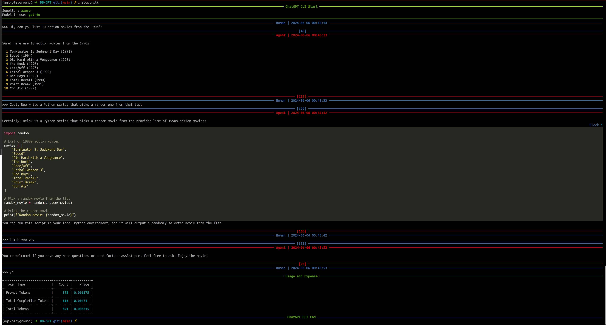

# ChatGPT CLI



## Overview

Simple script for chatting with ChatGPT from the command line, using the official API ([Released March 1st, 2023](https://openai.com/blog/introducing-chatgpt-and-whisper-apis)). It allows, after providing a valid API Key, to use ChatGPT at the maximum speed, at a fraction of the cost of a full ChatGPT Plus subscription (at least for the average user).

## How to get an API Key

Go to [platform.openai.com](https://platform.openai.com) and log-in with your OpenAI account (register if you don't have one). Click on your name initial in the top-right corner, then select *"View API keys"*. Finally click on *"Create new secret key"*. That's it.

You may also need to add a payment method, clicking on *Billing --> Payment methods*. New accounts should have some free credits, but adding a payment method may still be mandatory. For pricing, check [this page](https://openai.com/pricing).

## Installation and essential configuration

You need Python (at least version 3.10), Pip and Git installed on your system.

First update Pip (having an older version can cause troubles on some systems):

```console
pip install -U pip
```

Then, the installation is done simply with a single command:

```console
pip install git+https://github.com/marcolardera/chatgpt-cli
```

After that, you need to configure your API Key. There are three alternative ways to provide this parameter:

- Edit the `api-key` parameter in the *config.yaml* file (see paragraph below)
- Set the environment variable `OPENAI_API_KEY` (Check your operating system's documentation on how to do this)
- Use the command line option `--key` or `-k`

If more then one API Key is provided, ChatGPT CLI follows this priority order: *Command line option > Environment variable > Configuration file*

### Configuration file

The configuration file *config.yaml* can be found in the default config directory of the user defined by the [XDG Base Directory Specification](https://specifications.freedesktop.org/basedir-spec/basedir-spec-latest.html).

On a Linux/MacOS system it is defined by the $XDG_CONFIG_HOME variable (check it using `echo $XDG_CONFIG_HOME`). The default, if the variable is not set, should be the `~/.config` folder.

On the first execution of the script, a [template](config.yaml) of the config file is automatically created.

## Models

ChatGPT CLI, by default, uses the original `gpt-3.5-turbo` model. In order to use other ChatGPT models, edit the `model` parameter in the *config.yaml* file ore use the `--model` command line option. Here is a list of all the available options:

|Name|Pricing (input token)|Pricing(output token)|
|---|---|---|
|`gpt-3.5-turbo`|0.0015|0.002|
|`gpt-3.5-turbo-0613`|0.0015|0.002|
|`gpt-3.5-turbo-16k`|0.003|0.004|
|`gpt-4`|0.03|0.06|
|`gpt-4-0613`|0.03|0.06|
|`gpt-4-32k`|0.06|0.12|
|`gpt-4-32k-0613`|0.06|0.12|

Pricing is calculated as $/1000 tokens.

Check [this page](https://platform.openai.com/docs/models) for the technical details of each model.

## Basic usage

Launch the script typing in your terminal:

`chatgpt-cli`

Then just chat! The number next to the prompt is the [tokens](https://platform.openai.com/tokenizer) used in the conversation at that point.

Use the `/q` command to quit and show the number of total tokens used and an estimate of the expense for that session, based on the specific model in use.

For displaying all the available commands check the help with `chatgpt-cli --help`

## Multiline input

Add the `--multiline` (or `-ml`) flag in order to toggle multi-line input mode. In this mode use `Alt+Enter` or `Esc+Enter` to submit messages.

## Context

Use the `--context <FILE PATH>` command line option (or `-c` as a short version) in order to provide the model an initial context (technically a *system* message for ChatGPT). For example:

`chatgpt-cli --context notes.txt`

Both absolute and relative paths are accepted. Note that this option can be specified multiple times to give multiple files for context. Example:

`chatgpt-cli --context notes-from-thursday.txt --context notes-from-friday.txt`

Typical use cases for this feature are:

- Giving the model some code and ask to explain/refactor
- Giving the model some text and ask to rephrase with a different style (more formal, more friendly, etc)
- Asking for a translation of some text

## Markdown rendering

ChatGPT CLI automatically renders Markdown responses from the model, including code blocks, with appropriate formatting and syntax highlighting. **Update (31/05/2023):** Now tables are also rendered correctly, thanks to the new 13.4.0 release of Rich.

Change the `markdown` parameter from `true` to `false` in the `config.yaml` in order to disable this feature and display responses in plain text.

## Restoring previous sessions

ChatGPT CLI saves all the past conversations (including context and token usage) in the `session-history` folder inside the $XDG_CONFIG_HOME discussed in a previous paragraph. In order to restore a session the `--restore <YYYYMMDD-hhmmss>` (or `-r`) option is available. For example:

`chatgpt-cli --restore 20230728-162302` restores the session from the `$XDG_CONFIG_HOME/chatgpt-cli/session-history/chatgpt-session-20230728-162302.json` file. Then the chat goes on from that point.

It is also possible to use the special value `last`:

`chatgpt-cli --restore last`

In this case it restores the last chat session, without specifying the timestamp.

Note that, if `--restore` is set, it overwrites any `--context` option.

## Piping

ChatGPT CLI can be used in a UNIX pipeline thanks to the `--non-interactive` (or `-n`) mode. Here is an example:

`cat example_file.txt | chatgpt-cli -n`

In this case the content of `example_file` is sent directly to ChatGPT and the response is returned on the standard output. This allows to use the tool inside shell scripts.

## Contributing to this project

Please read [CONTRIBUTING.md](CONTRIBUTING.md)
