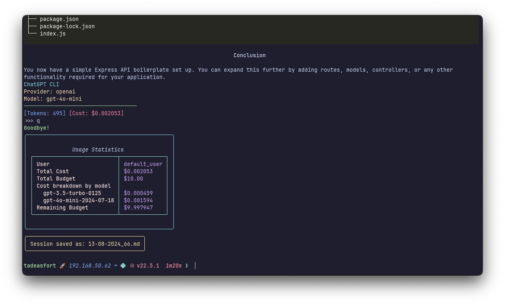

# ChatGPT CLI


## Overview

This project provides a command-line interface (CLI) for interacting with various large language models (LLMs) using the LiteLLM wrapper. It supports multiple providers, including OpenAI, Anthropic, Azure, and Gemini. The CLI allows users to chat with these models, manage budgets, and handle API keys efficiently.

## Big Refactor

The project has undergone a significant refactor to improve modularity and maintainability. The codebase is now split into multiple modules:

- **llm_api**: Handles interactions with the LLMs.
- **prompt**: Manages user prompts and input handling.
- **logs**: Manages logging and console output.
- **config**: Handles configuration, API keys, and budget management.

## Configuration

The configuration is managed through a `config.yaml` file. Below is an example configuration:

```yaml
provider: "anthropic"
model: "claude-3-sonnet-20240229"
temperature: 0.7
markdown: true
easy_copy: true
non_interactive: false
json_mode: false
use_proxy: false
proxy: "socks5://127.0.0.1:2080"
storage_format: "markdown"
embedding_model: "text-embedding-ada-002"
embedding_dimension: 1536
max_context_tokens: 3500
show_spinner: true
max_tokens: 1024
budget_enabled: true
budget_amount: 10.0
budget_duration: "monthly"
budget_user: "default_user"

# API Keys (uncomment and fill in as needed)
# openai_api_key: "<INSERT YOUR OPENAI API KEY HERE>"
# anthropic_api_key: "<INSERT YOUR ANTHROPIC API KEY HERE>"
# azure_api_key: "<INSERT YOUR AZURE API KEY HERE>"
# gemini_api_key: "<INSERT YOUR GEMINI API KEY HERE>"

# Azure specific settings (uncomment if using Azure)
# azure_endpoint: "https://xxxx.openai.azure.com/"
# azure_api_version: "2023-07-01-preview"
# azure_deployment_name: "gpt-35-turbo"
# azure_deployment_name_eb: "text-embedding-ada-002"
```

## Installation and Usage

1. **Install the CLI**:

    ```console
    pipx install git+https://github.com/tadeasf/chatgpt-cli.git@styling
    ```

2. **Configure the CLI**:
    Edit the `config.yaml` file to set your preferred provider, model, and other settings.

3. **Run the CLI**:

    ```console
    chatgpt-cli
    ```

4. **Commands**:
    - `/q`: Quit the application.
    - `/c <n>`: Copy the nth code block to the clipboard.
    - `/e`: Open the last response in the editor.

## Screenshots




## How It Works

### Interacting with LLMs

The `llm_api` module is responsible for sending messages to the LLM with the given context and returning the response. It handles different providers and ensures all messages have valid roles. The module uses LiteLLM's `completion` function to interact with the models.

#### Key Functions and Flow

1. **chat_with_context**:
    - This function sends a message to the LLM with the given context and returns the response.
    - It takes in the configuration dictionary, a list of messages, a prompt session, proxy configuration, and a flag to show a spinner.
    - It ensures all messages have valid roles and handles provider-specific requirements, such as prefix handling for Anthropic models.
    - It uses LiteLLM's `completion` function to get the response from the LLM.
    - The response is then processed by the `handle_response` function.

### LiteLLM Integration

- **Completion Function**: The `completion` function from LiteLLM is used to interact with the models. It takes in parameters such as the model, messages, and API key. For more details, refer to the [LiteLLM documentation on completion](https://docs.litellm.ai/docs/completion).

- **Provider-Specific Parameters**: The module handles provider-specific parameters, such as prefix handling for Anthropic models. For more details, refer to the [LiteLLM documentation on provider-specific parameters](https://docs.litellm.ai/docs/completion/provider_specific_params).

- **Response Handling**: The response from the LLM is processed to extract the content and usage statistics. For more details, refer to the [LiteLLM documentation on response output](https://docs.litellm.ai/docs/completion/output).

### Managing User Prompts

The `prompt` module manages user prompts and input handling. It provides features such as key bindings for quitting the application and opening the last response in an editor.

1. **start_prompt**:
    - This function starts the prompt loop and handles user input.
    - It takes in the prompt session, configuration dictionary, list of messages, token counts, and code blocks.
    - It handles special commands like quitting the application, copying code blocks, and opening the last response in an editor.

2. **add_markdown_system_message**:
    - This function adds a system message to instruct the model to use Markdown formatting.

3. **get_usage_stats**:
    - This function retrieves usage statistics for all users, including current cost, model costs, and total budget.

### Managing Expenses

The `expenses` module provides functions to display and calculate expenses based on token usage and pricing rates.

1. **display_expense**:
    - This function displays the current cost, total budget, and remaining budget for the user.
    - It uses the `BudgetManager` from the `config` module to get the current cost and total budget.

2. **calculate_expense**:
    - This function calculates the expense based on the number of tokens and pricing rates.

### Managing History

The `history` module provides functions to load and save conversation history.

1. **load_history_data**:
    - This function loads history data from a file. It supports both JSON and Markdown formats.

2. **save_history**:
    - This function saves the history data to a file. It supports both JSON and Markdown formats.

3. **calculate_tokens_and_cost**:
    - This function calculates the number of tokens and cost for a conversation.

### Configuration and Budget Management

The `config` module loads the configuration from the `config.yaml` file, initializes the budget manager, and provides utility functions for managing the configuration and budget. It uses LiteLLM's `BudgetManager` to handle budget constraints and track usage.

1. **load_config**:
    - This function loads the configuration from the config file and ensures all necessary keys are present.

2. **initialize_budget_manager**:
    - This function initializes the budget manager with the specified configuration.

3. **check_budget**:
    - This function checks if the current cost is within the budget limit.

### Main Application

The `chatgpt.py` file is the main entry point of the application. It initializes the CLI, handles user input, and coordinates interactions between different modules.

1. **Initialization**:
    - The script initializes global variables, sets up logging, and configures the CLI using [`rich_click`](https://github.com/ewels/rich-click).

2. **Model and Path Completion**:
    - The `ModelCompleter` and `PathCompleter` classes provide [autocompletion](https://python-prompt-toolkit.readthedocs.io/en/master/pages/asking_for_input.html) for model names and file paths, respectively.

3. **CLI Options**:
    - The script defines various CLI options using [`click`](https://click.palletsprojects.com/en/8.1.x/), such as setting the model, temperature, max tokens, API key, and more.

4. **Main Function**:
    - The `main` function handles the main logic of the application. It loads the configuration, validates the model, and starts the prompt session.
    - It checks the budget before making API calls and updates the budget after receiving responses.
    - It saves the conversation history and displays usage statistics.

I will eventually refactor the main function further.

## Contributing

Please read [CONTRIBUTING.md](CONTRIBUTING.md) for guidelines on contributing to this project.

## Logging

The `logs` module manages logging and console output. It uses the `loguru` library for logging. To enable verbose output for LiteLLM, set the environment variable `os.environ["LITELLM_LOG"] = "DEBUG"`.
